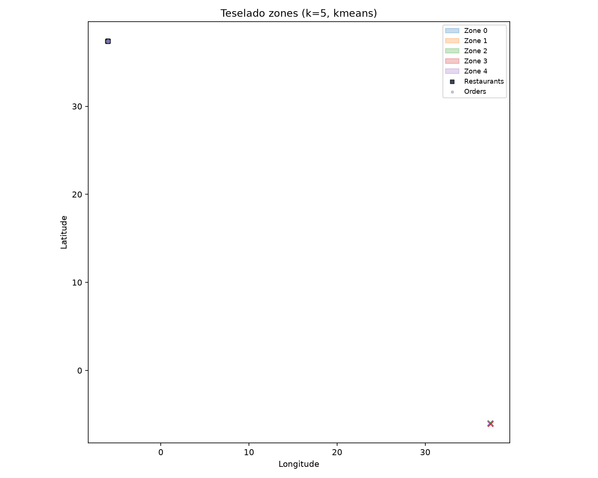
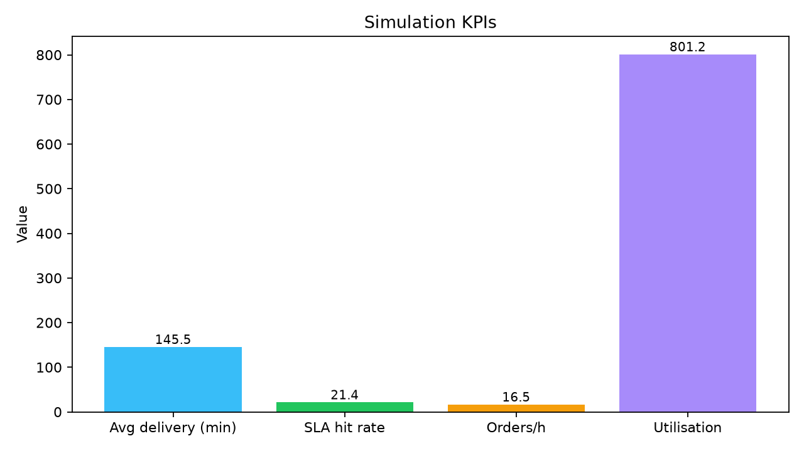
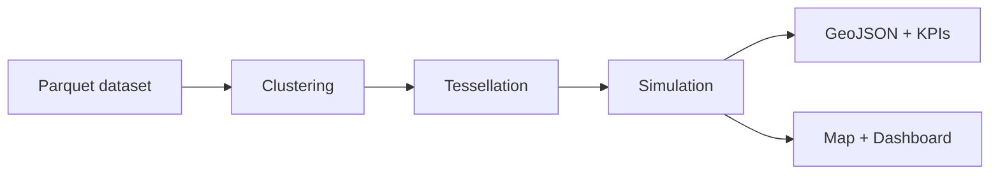

# Teselado

[](https://github.com/kegare825/teselado/actions/workflows/ci.yml)
[](https://github.com/kegare825/teselado/actions/workflows/pages.yml)


**Geospatial zone tessellation and last-mile delivery simulation.**

Originally prototyped in 2020, refactored into a reproducible open-source pipeline for
portfolio use. The project partitions delivery demand into operational zones,
evaluates tessellations, and simulates courier assignment with business KPIs.

**[Live demo (map + dashboard)](https://kegare825.github.io/teselado/map.html)**

> *Framework de optimización territorial para operaciones de last-mile delivery:
> clustering espacial → teselado operativo → simulación discreta → KPIs de negocio.*





## Problem

Last-mile delivery operators need to decide how many zones to run and how to staff them.
Too few zones create long routes and SLA breaches; too many zones increase idle couriers
and management overhead.

This project answers: **given order and restaurant locations, how do zone counts and
clustering methods affect delivery time, SLA compliance, and courier utilisation?**

## Key takeaway

On the bundled synthetic dataset, **k dominates the KPI outcome**: moving from k=5 to k=8
cuts average delivery time from ~146 min to ~38 min and raises SLA hit rate from ~21% to
~55%. The value of the project is **scenario comparison under the same haversine model**,
not tuning a single run. Use `teselado compare` for zone counts and
`teselado compare-methods` for K-Means vs Fuzzy C-Means at the same k.

## Solution



1. **Ingest** synthetic or OSM restaurant data (Parquet, seed=42)
2. **Cluster** with K-Means or Fuzzy C-Means and automatic k selection
3. **Tessellate** the city into zone polygons via grid sampling
4. **Simulate** discrete-event delivery with greedy or MIP assigner (**haversine** travel times)
5. **Export** GeoJSON, JSON metrics, Folium map, HTML dashboard, and static PNGs

See [docs/architecture.md](docs/architecture.md) and [CHANGELOG.md](CHANGELOG.md).

## Stack

| Layer | Tools |
|-------|-------|
| DS | K-Means, Fuzzy C-Means, elbow k-selection, haversine distances |
| DE | Typer CLI, Parquet, pydantic-settings, reproducible pipeline |
| BI | `report.json`, `dashboard.html`, Streamlit, GitHub Pages demo |
| Viz | Folium, Matplotlib, Shapely, GeoJSON |
| Quality | pytest, ruff, mypy, coverage, GitHub Actions |

## Quick start

```bash
python3 -m venv .venv
source .venv/bin/activate
pip install -e ".[dev]"

make sample    # generate data/sample (seed=42)
make run       # full pipeline → outputs/
make test      # 38 tests
make assets    # regenerate docs/images + docs/demo
```

Open the results:

```bash
xdg-open outputs/map.html
xdg-open outputs/dashboard.html
streamlit run streamlit_app.py   # optional live dashboard
```

## CLI

```bash
teselado generate --city demo --restaurants 50 --orders 500
teselado run --k-min 3 --k-max 8
teselado run --method fuzzy
teselado compare --k-values 3,5,8
teselado compare-methods --k 5 --methods kmeans,fuzzy
teselado fetch-osm --city demo --output data/osm
teselado cluster --k 5 --method fuzzy
teselado viz
teselado info
```

## Sample results (`data/sample`, k=5, kmeans)

| KPI | Value |
|-----|-------|
| Orders | 500 |
| Zones (k) | 5 |
| Avg delivery time | 145.5 min |
| SLA hit rate (30 min) | 21.4% |
| Orders / hour | 16.5 |
| Courier utilisation | 8.0% |

### Zone comparison (`teselado compare`)

| k | Avg delivery | SLA hit | Orders/h |
|---|-------------|---------|----------|
| 3 | 147.3 min | 25.6% | 16.4 |
| 5 | 145.5 min | 21.4% | 16.5 |
| 8 | **38.1 min** | **55.2%** | **19.9** |

### Method comparison at k=5 (`teselado compare-methods`)

Both methods share the **same haversine simulation** so differences come from
clustering/tessellation only:

| Method | Avg delivery | SLA hit | Boundary ambiguity |
|--------|-------------|---------|-------------------|
| kmeans | ~145 min | ~21% | — |
| fuzzy | ~similar | ~similar | ~15% orders near zone edge |

## Why Fuzzy C-Means for zone boundaries?

Zone edges are inherently ambiguous. Fuzzy C-Means keeps soft membership degrees
instead of hard 0/1 labels, exposing `boundary_ambiguity` in `report.json` — the
share of orders whose top-1 vs top-2 zone affinity is too close to call. That is
actionable for ops (e.g. route ambiguous orders to the less-loaded neighbouring zone).

Run `teselado run --method fuzzy` or `teselado compare-methods` to see it end to end.

## Technical decisions

- **Haversine distances (fixed)**: kept for all simulations so K-Means vs Fuzzy
  comparisons are apples-to-apples. Road-network distances are intentionally not mixed in.
- **K-Means + elbow**: fast, interpretable baseline
- **Fuzzy C-Means (`--method fuzzy`)**: boundary-ambiguity analysis
- **Greedy / MIP assigner**: greedy default; optional OR-Tools MIP (`assigner="mip"`)
- **Synthetic + OSM ingest**: no proprietary warehouse dependencies

## Project structure

```
src/teselado/
├── ingest/        # synthetic + OSM + loaders
├── clustering/    # K-Means, Fuzzy C-Means, k selector
├── tessellation/  # zone polygons
├── simulation/    # discrete-event engine + compare
├── viz/           # map, dashboard, static PNGs
└── pipeline.py
notebooks/zone_analysis.ipynb
docs/demo/         # GitHub Pages assets
```

## Development

```bash
make lint
make typecheck
make test
make compare-methods
make assets
```

CI runs lint, mypy, and pytest with coverage on Python 3.11 and 3.12.

## License

MIT — see [LICENSE](LICENSE).

## Authors & contributors

- **Aarón González** — original prototype (2020): fuzzy clustering, tessellation, simulation.
- **Carlos Moreno Morera** — contributed the initial K-Means module extraction (`MyKMeans.py`, one commit, July 2020).
- Refactored into an open-source portfolio pipeline (2026).
