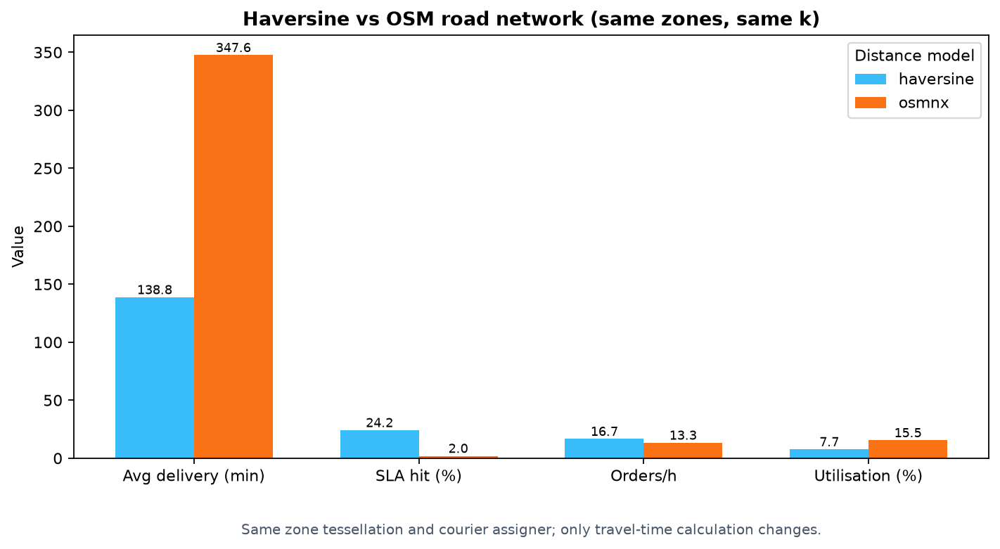
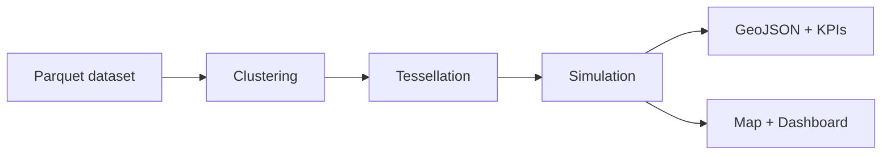

# Teselado

[](https://github.com/kegare825/teselado/actions/workflows/ci.yml)
[](https://github.com/kegare825/teselado/actions/workflows/pages.yml)


**Geospatial zone tessellation and last-mile delivery simulation.**

Originally prototyped in 2020, refactored into a reproducible open-source pipeline for
portfolio use. The project partitions delivery demand into operational zones,
evaluates tessellations, and simulates courier assignment with business KPIs.

**[Live demo (map + dashboard)](https://kegare825.github.io/teselado/map.html)**

> *Framework de optimización territorial para operaciones de last-mile delivery:
> clustering espacial → teselado operativo → simulación discreta → KPIs de negocio.*


*Coloured polygons = operational zones. Squares = restaurants, grey dots = orders.*


*Same zone tessellation (Fuzzy C-Means); only the travel-time model changes.*

## Problem

Last-mile delivery operators need to decide how to partition a city into zones and
how to estimate travel times for staffing and SLA planning. A straight-line
(haversine) model is fast but ignores roads; a road-network model (OSMnx) is
slower but closer to reality.

This project answers: **given the same zone tessellation, how do haversine and
OSM road-network distances change simulated delivery KPIs?**

## Key takeaway

The core comparison is **`teselado compare-distances`**: build zones once with
Fuzzy C-Means, then simulate the *same* tessellation with:

- **Haversine** — great-circle distance × average speed (baseline, fast)
- **OSMnx** — shortest path on OpenStreetMap drive network (real roads)

If the two models diverge materially on avg delivery time or SLA hit rate, your
operational plan is sensitive to how distances are modelled — exactly the kind
of insight a DS/DE portfolio piece should surface.

```bash
pip install -e ".[roads]"
teselado compare-distances --k 5 --methods haversine,osmnx
```

## Solution



1. **Ingest** synthetic or OSM restaurant data (Parquet, seed=42)
2. **Cluster** with K-Means or Fuzzy C-Means and automatic k selection
3. **Tessellate** the city into zone polygons via grid sampling
4. **Simulate** discrete-event delivery with configurable distance model (haversine or OSMnx)
5. **Export** GeoJSON, JSON metrics, Folium map, HTML dashboard, and static PNGs

See [docs/architecture.md](docs/architecture.md) and [CHANGELOG.md](CHANGELOG.md).

## Stack

| Layer | Tools |
|-------|-------|
| DS | Fuzzy C-Means tessellation, haversine vs OSMnx comparison |
| DE | Typer CLI, Parquet, pydantic-settings, reproducible pipeline |
| BI | `report.json`, `dashboard.html`, Streamlit, GitHub Pages demo |
| Viz | Folium, Matplotlib, Shapely, GeoJSON |
| Quality | pytest, ruff, mypy, coverage, GitHub Actions |

## Quick start

```bash
python3 -m venv .venv
source .venv/bin/activate
pip install -e ".[dev,roads]"

make sample    # generate data/sample (seed=42)
make run       # full pipeline → outputs/
make test      # 42 tests
make assets    # regenerate docs/images + docs/demo
```

Open the results:

```bash
xdg-open outputs/map.html
xdg-open outputs/dashboard.html
streamlit run streamlit_app.py   # optional live dashboard
```

## CLI

```bash
teselado generate --city demo --restaurants 50 --orders 500
teselado run --k-min 3 --k-max 8
teselado run --method fuzzy
teselado compare-distances --k 5 --methods haversine,osmnx
teselado compare --k-values 3,5,8
teselado fetch-osm --city demo --output data/osm
teselado cluster --k 5 --method fuzzy
teselado viz
teselado info
```

## Sample results (`data/sample`, k=5, kmeans)

| KPI | Value |
|-----|-------|
| Orders | 500 |
| Zones (k) | 5 |
| Avg delivery time | 145.5 min |
| SLA hit rate (30 min) | 21.4% |
| Orders / hour | 16.5 |
| Courier utilisation | 8.0% |

### Zone comparison (`teselado compare`)

| k | Avg delivery | SLA hit | Orders/h |
|---|-------------|---------|----------|
| 3 | 147.3 min | 25.6% | 16.4 |
| 5 | 145.5 min | 21.4% | 16.5 |
| 8 | **38.1 min** | **55.2%** | **19.9** |

### Distance model comparison (`teselado compare-distances`)

Same zones (k=5, Fuzzy C-Means), different travel-time models:

| Distance model | What it measures |
|----------------|------------------|
| **haversine** | Straight-line km × avg speed — fast baseline |
| **osmnx** | Shortest drive path on OSM graph — real roads |

Run locally to populate KPI bars in `docs/images/distance_comparison.png`.

## Why Fuzzy C-Means for zone boundaries?

Zone edges are inherently ambiguous. Fuzzy C-Means keeps soft membership degrees
instead of hard 0/1 labels, exposing `boundary_ambiguity` in `report.json` — the
share of orders whose top-1 vs top-2 zone affinity is too close to call. That is
actionable for ops (e.g. route ambiguous orders to the less-loaded neighbouring zone).

Run `teselado run --method fuzzy` to see it end to end.

## Technical decisions

- **Haversine vs OSMnx**: core portfolio comparison — same zones, different distance model
- **Fuzzy C-Means (`--method fuzzy`)**: default tessellation + boundary-ambiguity KPI
- **Greedy / MIP assigner**: greedy default; optional OR-Tools MIP (`assigner="mip"`)
- **Synthetic + OSM ingest**: no proprietary warehouse dependencies

## Project structure

```
src/teselado/
├── ingest/        # synthetic + OSM + loaders
├── clustering/    # K-Means, Fuzzy C-Means, k selector
├── tessellation/  # zone polygons
├── simulation/    # discrete-event engine + compare
├── viz/           # map, dashboard, static PNGs
└── pipeline.py
notebooks/zone_analysis.ipynb
docs/demo/         # GitHub Pages assets
```

## Development

```bash
make lint
make typecheck
make test
make compare-distances
make assets
```

CI runs lint, mypy, and pytest with coverage on Python 3.11 and 3.12.

## License

MIT — see [LICENSE](LICENSE).

## Authors & contributors

- **Aarón González** — original prototype (2020): fuzzy clustering, tessellation, simulation.
- **Carlos Moreno Morera** — contributed the initial K-Means module extraction (`MyKMeans.py`, one commit, July 2020).
- Refactored into an open-source portfolio pipeline (2026).
