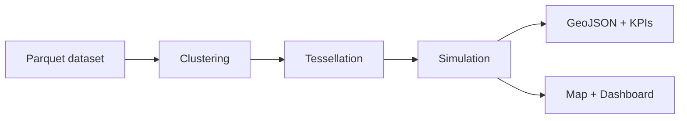

# Teselado

[](https://github.com/kegare825/teselado/actions/workflows/ci.yml)

**Geospatial zone tessellation and last-mile delivery simulation.**

Originally prototyped in 2020, refactored into a reproducible open-source pipeline for
portfolio use. The project partitions synthetic delivery demand into operational zones,
evaluates tessellations, and simulates courier assignment with business KPIs.

> *Framework de optimización territorial para operaciones de last-mile delivery:
> clustering espacial → teselado operativo → simulación discreta → KPIs de negocio.*

## Problem

Last-mile delivery operators need to decide how many zones to run and how to staff them.
Too few zones create long routes and SLA breaches; too many zones increase idle couriers
and management overhead.

This project answers: **given order and restaurant locations, how do zone counts affect
delivery time, SLA compliance, and courier utilisation?**

## Solution



1. **Ingest** synthetic restaurants and orders (Parquet, seed=42)
2. **Cluster** delivery coordinates with K-Means (or Fuzzy C-Means) and automatic k selection
3. **Tessellate** the city into zone polygons via grid sampling
4. **Simulate** a discrete-event delivery process with greedy courier assignment
5. **Export** GeoJSON, JSON metrics, Folium map, and HTML dashboard

See [docs/architecture.md](docs/architecture.md) for design decisions and trade-offs.

## Stack

| Layer | Tools |
|-------|-------|
| DS | K-Means, Fuzzy C-Means, elbow k-selection, haversine distances |
| DE | Typer CLI, Parquet, pydantic-settings, reproducible pipeline |
| BI | `report.json`, `dashboard.html`, interactive `map.html` |
| Viz | Folium, Shapely, GeoJSON |
| Quality | pytest, ruff, GitHub Actions |

## Quick start

```bash
python3 -m venv .venv
source .venv/bin/activate
pip install -e ".[dev]"

make sample    # generate data/sample (seed=42)
make run       # full pipeline → outputs/
make test      # 22 tests
```

Open the results:

```bash
xdg-open outputs/map.html        # interactive zone map
xdg-open outputs/dashboard.html  # KPI dashboard
```

## CLI

```bash
teselado generate --city demo --restaurants 50 --orders 500
teselado run --k-min 3 --k-max 8
teselado run --method fuzzy         # Fuzzy C-Means: adds boundary_ambiguity to report.json
teselado cluster --k 5 --method fuzzy
teselado compare --k-values 3,5,8
teselado viz
teselado info
```

## Sample results (`data/sample`, k=5)

| KPI | Value |
|-----|-------|
| Orders | 500 |
| Zones (k) | 5 |
| Avg delivery time | 145.5 min |
| SLA hit rate (30 min) | 21.4% |
| Orders / hour | 16.5 |
| Courier utilisation | 8.0% |

### Zone comparison (`teselado compare`)

| k | Avg delivery | SLA hit | Orders/h |
|---|-------------|---------|----------|
| 3 | 147.3 min | 25.6% | 16.4 |
| 5 | 145.5 min | 21.4% | 16.5 |
| 8 | **38.1 min** | **55.2%** | **19.9** |

More zones improve delivery time on this synthetic dataset — useful for scenario analysis.

### Visual outputs

After `make run`, open `outputs/map.html` to explore:

- coloured zone polygons
- restaurant and order points
- per-zone legend with order counts

> **Portfolio tip:** capture a screenshot of `outputs/map.html` and save it as
> `docs/images/map.png` for your CV or README.

## Project structure

```
src/teselado/
├── ingest/        # synthetic data + loaders
├── clustering/    # K-Means + k selector
├── tessellation/  # zone polygons
├── simulation/    # discrete-event engine
├── viz/           # map + dashboard export
└── pipeline.py    # orchestration
```

## Why Fuzzy C-Means for zone boundaries?

Zone partitioning is not actually a hard-boundary problem. An order placed
two streets from the edge of "Zone A" doesn't stop belonging to Zone A the
instant it crosses a line drawn by K-Means — it has *partial* affinity to
both neighbouring zones, and that ambiguity is real operational information,
not noise.

**Fuzzy C-Means keeps that information instead of discarding it.** Every
order gets a degree of membership to *every* zone (not just a 0/1 label), so
the model can answer a question hard K-Means structurally cannot: *how many
of my orders are actually borderline, and by how much?*

That turns into a concrete, testable KPI — `boundary_ambiguity` in
`report.json` — reporting the share of orders whose top-1 vs. top-2 zone
membership is too close to call. On the bundled sample it flags a real,
non-trivial share of demand as "genuinely ambiguous," which is directly
actionable for ops (e.g. *always route ambiguous orders to whichever
neighbouring zone has spare courier capacity*, rather than being locked into
a rigid polygon). Run `teselado run --method fuzzy` to see it end to end.

This is also why the choice held up under scrutiny in production: a hard
clustering baseline (K-Means) is the right *default* for interpretability and
speed, but a fuzzy model is the right *lens* when the business question is
about edges and hand-offs between zones, not just their interiors — which is
exactly the shape of a last-mile delivery problem, where the busiest, most
expensive minutes happen right at those boundaries.

## Technical decisions

- **K-Means + elbow**: fast, interpretable baseline for zone partitioning
- **Fuzzy C-Means (`--method fuzzy`)**: soft membership for boundary-ambiguity analysis — see above
- **Greedy assigner**: nearest available courier; easy to explain, good for prototyping
- **Synthetic data**: no proprietary warehouse dependencies; safe for public repos
- **Haversine distances**: no OSM graph required; swappable later for road networks

## Roadmap

- [ ] OSM / Overpass restaurant ingestion (`ingest/osm.py`)
- [ ] Road-network distances with OSMnx
- [ ] Silhouette / HDBSCAN for k selection
- [ ] Fuzzy-aware courier assignment (route boundary orders to less-loaded zones)
- [ ] MIP assigner with OR-Tools
- [ ] Streamlit live dashboard

## Development

```bash
make lint
make test
make compare
```

CI runs on Python 3.11 and 3.12 via GitHub Actions.

## License

MIT — see [LICENSE](LICENSE).

## Authors & contributors

- **Aarón González** — original prototype (2020): fuzzy clustering, tessellation, simulation.
- **Carlos Moreno Morera** — contributed the initial K-Means module extraction (`MyKMeans.py`, one commit, July 2020).
- Refactored into an open-source portfolio pipeline (2026).
