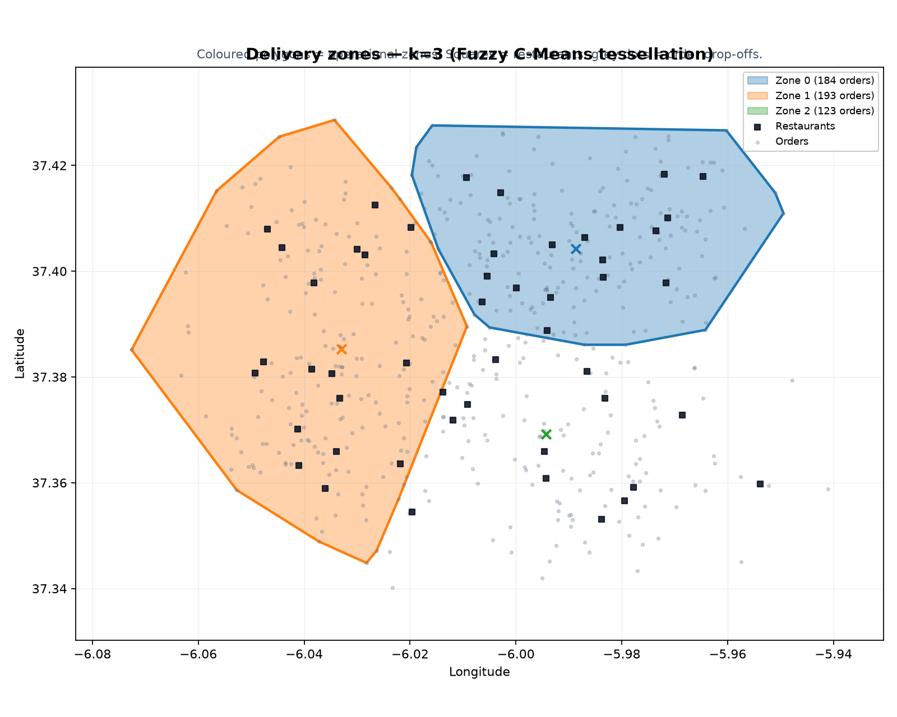
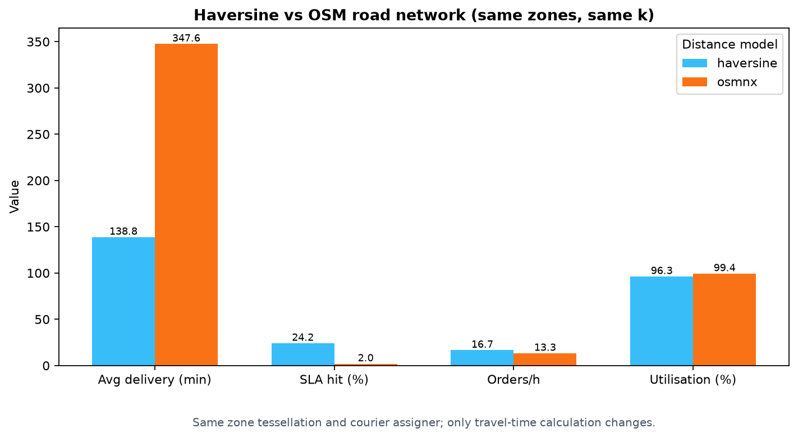
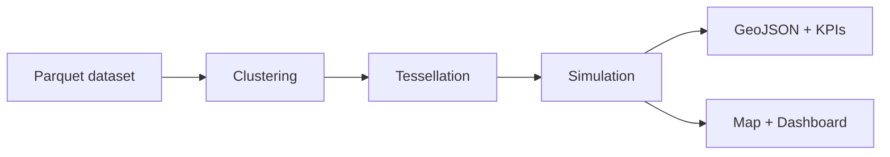

# Teselado

[](https://github.com/kegare825/teselado/actions/workflows/ci.yml)


**Geospatial zone tessellation and last-mile delivery simulation.**

Originally prototyped in 2020, refactored into a reproducible open-source pipeline.
The project partitions delivery demand into operational zones, evaluates
tessellations, and simulates courier assignment with business KPIs.

**[Live demo (map + dashboard)](https://kegare825.github.io/teselado/map.html)** —
built by [`pages.yml`](.github/workflows/pages.yml) on every push to `master`.
The link resolves once GitHub Pages is enabled for the repository
(*Settings → Pages → Build and deployment → Source: "GitHub Actions"*); the same
files can be generated locally with `make assets` (see `docs/demo/`).

> *Framework de optimización territorial para operaciones de last-mile delivery:
> clustering espacial → teselado operativo → simulación discreta → KPIs de negocio.*


*Coloured polygons = operational zones. Squares = restaurants, grey dots = orders.*


*Same zone tessellation (Fuzzy C-Means); only the travel-time model changes.*

## Problem

Last-mile delivery operators need to decide how to partition a city into zones and
how to estimate travel times for staffing and SLA planning. A straight-line
(haversine) model is fast but ignores roads; a road-network model (OSMnx) is
slower but closer to reality.

This project answers: **given the same zone tessellation, how do haversine and
OSM road-network distances change simulated delivery KPIs?**

## Key takeaway

The core comparison is **`teselado compare-distances`**: build zones once with
Fuzzy C-Means, then simulate the *same* tessellation with:

- **Haversine** — great-circle distance × average speed (baseline, fast)
- **OSMnx** — shortest path on OpenStreetMap drive network (real roads)

If the two models diverge materially on avg delivery time or SLA hit rate, the
operational plan is sensitive to how distances are modelled, and staffing or SLA
targets derived from the haversine baseline should be re-validated with
road-network travel times before use.

```bash
pip install -e ".[roads]"
teselado compare-distances --k 5 --methods haversine,osmnx
```

## Solution


```mermaid
flowchart LR
    A[Parquet dataset] --> B[Clustering]
    B --> C[Tessellation]
    C --> D[Simulation]
    D --> E[GeoJSON + KPIs]
    D --> F[Map + Dashboard]
```

1. **Ingest** synthetic or OSM restaurant data (Parquet, seed=42)
2. **Cluster** with K-Means or Fuzzy C-Means and automatic k selection
3. **Tessellate** the city into zone polygons via grid sampling
4. **Simulate** discrete-event delivery with configurable distance model (haversine or OSMnx)
5. **Export** GeoJSON, JSON metrics, Folium map, HTML dashboard, and static PNGs

See [docs/architecture.md](docs/architecture.md) and [CHANGELOG.md](CHANGELOG.md).

## Stack

| Layer | Tools |
|-------|-------|
| DS | Fuzzy C-Means tessellation, haversine vs OSMnx comparison |
| DE | Typer CLI, Parquet, pydantic-settings, reproducible pipeline |
| BI | `report.json`, `dashboard.html`, Streamlit, GitHub Pages demo |
| Viz | Folium, Matplotlib, Shapely, GeoJSON |
| Quality | pytest, ruff, mypy, coverage, GitHub Actions |

## Quick start

```bash
python3 -m venv .venv
source .venv/bin/activate
pip install -e ".[dev,roads]"

make sample    # generate data/sample (seed=42)
make run       # full pipeline → outputs/
make test      # pytest (MIP test skips unless ortools is installed)
make assets    # regenerate docs/images + docs/demo
```

Open the results:

```bash
xdg-open outputs/map.html
xdg-open outputs/dashboard.html
streamlit run streamlit_app.py   # optional live dashboard
```

## CLI

```bash
teselado generate --city demo --restaurants 50 --orders 500
teselado run --k-min 3 --k-max 8
teselado run --method fuzzy
teselado compare-distances --k 5 --methods haversine,osmnx
teselado compare --k-values 3,5,8
teselado fetch-osm --city demo --output data/osm
teselado cluster --k 5 --method fuzzy
teselado viz
teselado info
```

## Sample results (`data/sample`, `teselado run`, k=5 auto-selected, kmeans)

Output of `teselado run` on the committed sample (500 orders over 24 h, 50 restaurants,
5 couriers, 25 km/h, 5 min handling, haversine distances):

| KPI | Value |
|-----|-------|
| Orders | 500 |
| Zones (k) | 5 |
| Couriers | 5 |
| Simulation window | 30.3 h |
| Avg delivery time | 145.5 min |
| SLA hit rate (30 min) | 21.4% |
| Orders / hour | 16.5 |
| Courier utilisation | 96.1% |

**How to read these numbers.** The KPI definitions (`simulation/metrics.py`) matter:

- *Avg delivery time* is the order **cycle time**, `delivered_at - placed_at`, so it
  includes the time an order waits in the queue for a free courier. With 5 couriers
  for ~21 orders/hour the fleet is saturated (utilisation 96%), the queue grows
  through the day and most of the 145 min is waiting, not driving: on this run the
  mean service time per order (drive to restaurant + 5 min handling + drive to
  customer) is 17.4 min and the mean queue wait is 128 min.
- *Courier utilisation* is `sum(delivered_at - assigned_at) / (window x couriers)`,
  a 0-1 ratio of service time over capacity; queue wait is not counted as busy time.
- *Simulation window* runs from the first order placed to the last one delivered
  (30.3 h for 24 h of demand: the backlog spills past midnight), and *orders/hour*
  divides completed orders by that window.
- *SLA hit rate* is the share of orders with cycle time `<= 30 min`.

Note that `teselado run` selects `k` automatically by elbow on WCSS; `teselado run`
on the sample picks k=5 with K-Means and k=3 with Fuzzy C-Means.

### Zone comparison (`teselado compare`, kmeans, haversine)

| k | Couriers | Avg delivery | SLA hit | Orders/h | Utilisation |
|---|----------|-------------|---------|----------|-------------|
| 3 | 5 | 147.3 min | 25.6% | 16.4 | 96.0% |
| 5 | 5 | 145.5 min | 21.4% | 16.5 | 96.1% |
| 8 | 8 | **38.1 min** | **55.2%** | **19.9** | 65.9% |

The k=8 improvement is mostly a **capacity effect, not a zoning effect**: the simulator
places at least one courier in every zone (`build_couriers`), so with `num_couriers=5`
and k=8 the run has 8 couriers. Compare k values with `num_couriers >= k` to isolate
the tessellation itself.

### Distance model comparison (`teselado compare-distances` / `make assets`)

Same zones (k=3, Fuzzy C-Means, as auto-selected by `make assets`), 5 couriers,
different travel-time models:

| Distance model | What it measures | Avg delivery | SLA hit | Orders/h | Utilisation |
|----------------|------------------|-------------|---------|----------|-------------|
| **haversine** | Straight-line km × avg speed | 138.8 min | 24.2% | 16.7 | 96.3% |
| **osmnx** | Shortest drive path on the OSM graph | 347.6 min | 2.0% | 13.4 | 99.4% |

Road-network distances are longer than straight lines, so each order takes more
service time; with the fleet already saturated the extra minutes compound into a much
longer queue. The straight-line baseline therefore materially understates delivery
times for this staffing level. `docs/images/distance_comparison.png` shows the same
KPIs as bars; `teselado compare-distances --k 5` runs the comparison at a fixed k.

## Why Fuzzy C-Means for zone boundaries?

Zone edges are inherently ambiguous. Fuzzy C-Means keeps soft membership degrees
instead of hard 0/1 labels, exposing `boundary_ambiguity` in `report.json` — the
share of orders whose top-1 vs top-2 zone affinity is too close to call. That is
actionable for ops (e.g. route ambiguous orders to the less-loaded neighbouring zone).

Run `teselado run --method fuzzy` to see it end to end.

## Technical decisions

- **Haversine vs OSMnx**: core comparison — same zones, different distance model
- **Fuzzy C-Means (`--method fuzzy`)**: default tessellation for `compare-distances` and
  `make assets`, plus the boundary-ambiguity KPI (`teselado run` defaults to K-Means)
- **Greedy / MIP assigner**: greedy default; optional OR-Tools min-cost matching
  (`Settings(assigner="mip")`, `pip install -e ".[mip]"`)
- **Synthetic + OSM ingest**: no proprietary warehouse dependencies

## Project structure

```
src/teselado/
├── ingest/        # synthetic + OSM + loaders
├── clustering/    # K-Means, Fuzzy C-Means, k selector
├── tessellation/  # zone polygons
├── simulation/    # discrete-event engine + compare
├── viz/           # map, dashboard, static PNGs
└── pipeline.py
notebooks/zone_analysis.ipynb
docs/demo/         # GitHub Pages assets (built by make assets / pages.yml)
```

## Development

```bash
make lint
make typecheck
make test
make compare-distances
make assets
```

CI (`.github/workflows/ci.yml`) runs ruff, mypy, and pytest with coverage on
Python 3.11 and 3.12. `pages.yml` builds `docs/demo` with the `[roads]` extra and
deploys it to GitHub Pages; if OSMnx or Overpass is unavailable the asset script
falls back to a haversine-only chart (`--no-roads` forces that behaviour).

## License

MIT — see [LICENSE](LICENSE).

## Authors & contributors

- **Aarón González** — original prototype (2020): fuzzy clustering, tessellation, simulation.
- **Carlos Moreno Morera** — contributed the initial K-Means module extraction (`MyKMeans.py`, one commit, July 2020).
- Refactored into an open-source pipeline with CI, tests, and documentation (2026).
