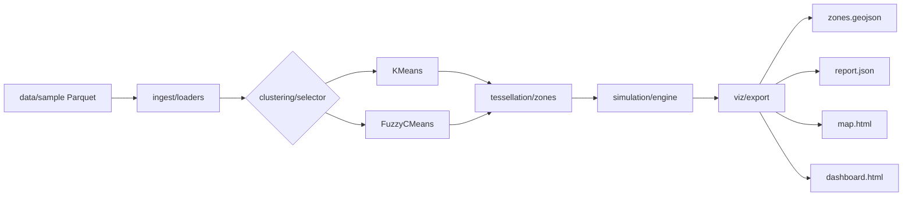

# Architecture

## Overview

Teselado is a reproducible Python pipeline that partitions delivery demand into
operational zones, evaluates tessellations, and simulates last-mile logistics
with business KPIs.

The project is designed as a portfolio case study for a senior data profile
spanning data science, data engineering, and BI.

## Data flow

## Module responsibilities

| Module | Role |
|--------|------|
| `ingest/synthetic.py` | Generate synthetic restaurants and orders with realistic timestamps |
| `ingest/loaders.py` | Load and validate canonical Parquet datasets |
| `clustering/kmeans.py` | Custom K-Means with configurable distance metric |
| `clustering/fuzzy_kmeans.py` | Fuzzy C-Means, same interface as `KMeans`, exposes soft membership |
| `clustering/ambiguity.py` | Boundary-ambiguity metrics computed from fuzzy membership |
| `clustering/selector.py` | Automatic k selection via elbow on WCSS (works with either backend) |
| `tessellation/zones.py` | Grid sampling + convex hulls → zone polygons |
| `simulation/agents.py` | Restaurant, courier, and order entities |
| `simulation/assigner.py` | Greedy nearest-courier assignment |
| `simulation/engine.py` | Discrete-event queue: placed → assigned → delivered |
| `simulation/distance.py` | Haversine and OSMnx distance calculators |
| `simulation/compare.py` | Compare k values and distance models |
| `simulation/metrics.py` | SLA, utilisation, throughput KPIs |
| `viz/map.py` | Folium interactive map |
| `viz/dashboard.py` | Self-contained HTML BI dashboard |
| `pipeline.py` | Orchestrates the full run |

## Design decisions

### Haversine vs OSMnx (core portfolio comparison)

`teselado compare-distances` tessellates zones once (default: Fuzzy C-Means), then
re-runs the discrete-event simulation with two distance calculators:

- **Haversine** — straight-line km × average speed (fast baseline)
- **OSMnx** — shortest drive path on a cached OpenStreetMap graph

Only `simulation/distance.py` changes between runs; clustering, tessellation, and
courier assigner stay fixed.

### Fuzzy C-Means tessellation

Fuzzy C-Means is the default zone builder. Soft membership powers the
`boundary_ambiguity` KPI for orders near zone edges. K-Means remains available
via `--method kmeans` but is not the portfolio focus.

### Greedy courier assignment

The assigner picks the nearest available courier to the restaurant, preferring
couriers in the same zone. This is easy to explain in interviews and fast enough
for scenario comparison.

An MIP-based assigner (e.g. OR-Tools) is a documented roadmap item.

### Synthetic data only

The pipeline intentionally uses fully synthetic data with public geographic
bounding boxes. This avoids proprietary warehouse schemas while still
demonstrating realistic spatial clustering and demand peaks.

## Simulation model

Each order follows this simplified lifecycle:

1. **Placed** at `placed_at`
2. **Assigned** to the best available courier
3. **Pickup** after travel to restaurant + fixed handling time
4. **Delivered** after travel to customer location

KPIs are aggregated per zone and globally:

- average delivery time
- SLA hit rate
- orders per hour
- courier utilisation

## Trade-offs

| Choice | Benefit | Cost |
|--------|---------|------|
| Synthetic data | Safe for public portfolio | Less realism than production logs |
| Haversine distance | No external graph dependency | Ignores road network |
| Greedy assigner | Simple, fast, explainable | Not globally optimal |
| HTML dashboard | Zero extra runtime deps | Not a live BI server |

## Extension points

- `ingest/osm.py` — public POI ingestion via Overpass
- `simulation/compare.py` — compare multiple k values
- `clustering/fuzzy_kmeans.py` — soft membership already exposed; a natural next step
  is a "fuzzy boundary policy" in the simulator that routes ambiguous orders to
  whichever adjacent zone has more courier capacity
- Road-network distances via OSMnx
- MIP assignment via OR-Tools
