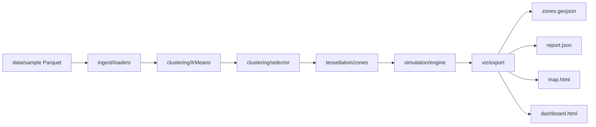

# Architecture

## Overview

Teselado is a reproducible Python pipeline that partitions delivery demand into
operational zones, evaluates tessellations, and simulates last-mile logistics
with business KPIs.

The project is designed as a portfolio case study for a senior data profile
spanning data science, data engineering, and BI.

## Data flow

## Module responsibilities

| Module | Role |
|--------|------|
| `ingest/synthetic.py` | Generate synthetic restaurants and orders with realistic timestamps |
| `ingest/loaders.py` | Load and validate canonical Parquet datasets |
| `clustering/kmeans.py` | Custom K-Means with configurable distance metric |
| `clustering/selector.py` | Automatic k selection via elbow on WCSS |
| `tessellation/zones.py` | Grid sampling + convex hulls → zone polygons |
| `simulation/agents.py` | Restaurant, courier, and order entities |
| `simulation/assigner.py` | Greedy nearest-courier assignment |
| `simulation/engine.py` | Discrete-event queue: placed → assigned → delivered |
| `simulation/metrics.py` | SLA, utilisation, throughput KPIs |
| `viz/map.py` | Folium interactive map |
| `viz/dashboard.py` | Self-contained HTML BI dashboard |
| `pipeline.py` | Orchestrates the full run |

## Design decisions

### K-Means + elbow selector

K-Means is fast, interpretable, and sufficient to demonstrate zone partitioning.
The elbow heuristic on within-cluster sum of squares provides an automatic
starting point for k without adding scikit-learn as a hard dependency.

Fuzzy C-Means remains available in `clustering/fuzzy.py` as an exploratory
extension from the original 2020 prototype.

### Euclidean geography

Distances use haversine or planar approximations on lat/lng coordinates.
This keeps the project self-contained and runnable without OSM graph downloads.

A future iteration can swap the distance function for OSMnx road-network shortest
paths without changing the simulation interface.

### Greedy courier assignment

The assigner picks the nearest available courier to the restaurant, preferring
couriers in the same zone. This is easy to explain in interviews and fast enough
for scenario comparison.

An MIP-based assigner (e.g. OR-Tools) is a documented roadmap item.

### Synthetic data only

The pipeline intentionally uses fully synthetic data with public geographic
bounding boxes. This avoids proprietary warehouse schemas while still
demonstrating realistic spatial clustering and demand peaks.

## Simulation model

Each order follows this simplified lifecycle:

1. **Placed** at `placed_at`
2. **Assigned** to the best available courier
3. **Pickup** after travel to restaurant + fixed handling time
4. **Delivered** after travel to customer location

KPIs are aggregated per zone and globally:

- average delivery time
- SLA hit rate
- orders per hour
- courier utilisation

## Trade-offs

| Choice | Benefit | Cost |
|--------|---------|------|
| Synthetic data | Safe for public portfolio | Less realism than production logs |
| Haversine distance | No external graph dependency | Ignores road network |
| Greedy assigner | Simple, fast, explainable | Not globally optimal |
| HTML dashboard | Zero extra runtime deps | Not a live BI server |

## Extension points

- `ingest/osm.py` — public POI ingestion via Overpass
- `simulation/compare.py` — compare multiple k values
- `clustering/fuzzy.py` — soft clustering experiments
- Road-network distances via OSMnx
- MIP assignment via OR-Tools
