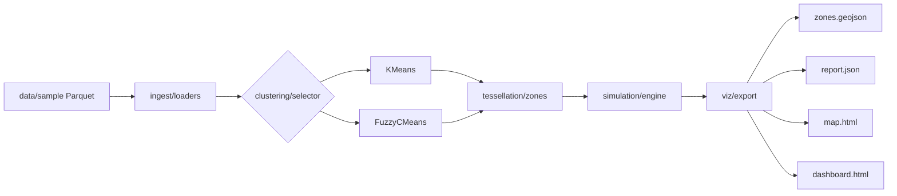

# Architecture

## Overview

Teselado is a reproducible Python pipeline that partitions delivery demand into
operational zones, evaluates tessellations, and simulates last-mile logistics
with business KPIs.

The codebase covers three layers: spatial modelling (clustering and tessellation),
a reproducible data pipeline (CLI, Parquet, typed settings), and reporting
(JSON metrics, HTML dashboard, maps).

## Data flow

```mermaid
flowchart LR
    A[data/sample Parquet] --> B[ingest/loaders]
    B --> C{clustering/selector}
    C --> C1[KMeans]
    C --> C2[FuzzyCMeans]
    C1 --> D[tessellation/zones]
    C2 --> D
    D --> E[simulation/engine]
    E --> F[viz/export]
    F --> G[zones.geojson]
    F --> H[report.json]
    F --> I[map.html]
    F --> J[dashboard.html]
```

## Module responsibilities

| Module | Role |
|--------|------|
| `ingest/synthetic.py` | Generate synthetic restaurants and orders with realistic timestamps |
| `ingest/loaders.py` | Load and validate canonical Parquet datasets |
| `clustering/kmeans.py` | Custom K-Means with configurable distance metric |
| `clustering/fuzzy_kmeans.py` | Fuzzy C-Means, same interface as `KMeans`, exposes soft membership |
| `clustering/ambiguity.py` | Boundary-ambiguity metrics computed from fuzzy membership |
| `clustering/selector.py` | Automatic k selection via elbow on WCSS (works with either backend) |
| `tessellation/zones.py` | Grid sampling + convex hulls → zone polygons |
| `simulation/agents.py` | Restaurant, courier, and order entities |
| `simulation/assigner.py` | Greedy nearest-courier assignment (default) |
| `simulation/mip_assigner.py` | Optional OR-Tools min-cost matching for orders pending at the same instant (`[mip]` extra) |
| `simulation/engine.py` | Discrete-event queue: placed → assigned → delivered |
| `simulation/distance.py` | Haversine and OSMnx distance calculators |
| `simulation/compare.py` | Compare k values and distance models |
| `simulation/metrics.py` | SLA, utilisation, throughput KPIs |
| `viz/map.py` | Folium interactive map |
| `viz/dashboard.py` | Self-contained HTML BI dashboard |
| `pipeline.py` | Orchestrates the full run |

## Design decisions

### Haversine vs OSMnx (core comparison)

`teselado compare-distances` tessellates zones once (default: Fuzzy C-Means), then
re-runs the discrete-event simulation with two distance calculators:

- **Haversine** — straight-line km × average speed (fast baseline)
- **OSMnx** — shortest drive path on a cached OpenStreetMap graph

Only `simulation/distance.py` changes between runs; clustering, tessellation, and
courier assigner stay fixed.

### Fuzzy C-Means tessellation

Fuzzy C-Means is the default zone builder. Soft membership powers the
`boundary_ambiguity` KPI for orders near zone edges. K-Means remains available
via `--method kmeans` but is not the portfolio focus.

### Courier assignment: greedy by default, MIP optional

The default assigner (`simulation/assigner.py`) picks the nearest available courier
to the restaurant, preferring couriers in the same zone. It is deterministic and
fast enough for scenario comparison.

`simulation/mip_assigner.py` implements an alternative based on OR-Tools: orders
that become available at the same simulation instant are batched and matched to
available couriers by solving a min-cost bipartite assignment (same-zone pairs get
a 0.8 cost factor). It is enabled with `SimulationParams(assigner="mip")` /
`Settings(assigner="mip")` and requires `pip install -e ".[mip]"`. If OR-Tools is not
installed, or only one order is pending, it falls back to the greedy rule.

### Synthetic data only

The pipeline intentionally uses fully synthetic data with public geographic
bounding boxes. This avoids proprietary warehouse schemas while still
demonstrating realistic spatial clustering and demand peaks.

## Simulation model

Each order follows this simplified lifecycle:

1. **Placed** at `placed_at`
2. **Assigned** to the best available courier
3. **Pickup** after travel to restaurant + fixed handling time
4. **Delivered** after travel to customer location

KPIs (`simulation/metrics.py`) are aggregated per zone and globally. Exact
definitions, since they drive how the numbers should be read:

- **Average delivery time** = mean of `delivered_at - placed_at`, i.e. the order
  cycle time *including* the time spent waiting for a free courier.
- **SLA hit rate** = share of orders whose cycle time is `<= sla_minutes` (default 30).
- **Orders per hour** = completed orders / simulation duration, where the duration
  runs from the first order placed to the last order delivered.
- **Courier utilisation** = sum of courier service time (`delivered_at - assigned_at`,
  queue wait excluded) / (simulation duration x number of couriers). A 0-1 ratio.

Note that `build_couriers` places at least one courier per zone, so a run with
`k > num_couriers` effectively has `k` couriers.

## Trade-offs

| Choice | Benefit | Cost |
|--------|---------|------|
| Synthetic data | Safe for public portfolio | Less realism than production logs |
| Haversine distance (default) | No external graph dependency | Ignores road network; OSMnx mode available via `[roads]` |
| Greedy assigner (default) | Simple, fast, explainable | Not globally optimal; MIP assigner available via `[mip]` |
| HTML dashboard | Zero extra runtime deps | Not a live BI server |

## Extension points

Already implemented and available to build on:

- `ingest/osm.py` — public POI ingestion via Overpass (`teselado fetch-osm`)
- `simulation/compare.py` — compare k values, clustering methods, and distance models
- `simulation/distance.py` — road-network distances via OSMnx (`[roads]` extra)
- `simulation/mip_assigner.py` — MIP assignment via OR-Tools (`[mip]` extra)

Natural next steps:

- `clustering/fuzzy_kmeans.py` already exposes soft membership; a "fuzzy boundary
  policy" in the simulator could route ambiguous orders to whichever adjacent zone
  has more courier capacity.
- Time-windowed batching for the MIP assigner (currently only orders placed at the
  exact same instant are batched).
